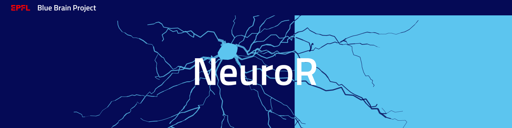

|banner|

|build| |license| |docs| |doi|

NeuroR
======

Introduction
------------

NeuroR is a collection of tools to repair morphologies.

You can try NeuroR's functionality on MyBinder:

- Cut-plane detection - |cutplane|
- Morphology repair - |repair|

Acknowledgements
----------------

The development of this software was supported by funding to the Blue Brain Project, a research center of the École polytechnique fédérale de Lausanne (EPFL), from the Swiss government’s ETH Board of the Swiss Federal Institutes of Technology.

This research was supported by the EBRAINS research infrastructure, funded from the European Union’s Horizon 2020 Framework Programme for Research and Innovation under the Specific Grant Agreement No. 945539 (Human Brain Project SGA3).

Citation
--------

Cite NeuroR with the following DOI: |doi|

NeuroR implements the methods discussed in the following paper:

   Anwar H., Riachi I., Schürmann F., Markram H. (2009). “An approach to capturing neuron morphological diversity,”
   in Computational Neuroscience: Realistic Modeling for Experimentalistsed. De Schutter E.,
   editor. (Cambridge: The MIT Press) 211–232

   `DOI: 10.7551/mitpress/9780262013277.003.0010 <https://doi.org/10.7551/mitpress/9780262013277.003.0010>`__

Morphology repair with NeuroR
-----------------------------

There are presently three types of repair which are outlined below.

Sanitization
~~~~~~~~~~~~

This is the process of sanitizing a morphological file. It currently:

- ensures it can be loaded with MorphIO
- raises if the morphology has no soma or of invalid format
- removes unifurcations
- set negative diameters to zero
- raises if the morphology has a neurite whose type changes along the way
- removes segments with near zero lengths (shorter than 1e-4)

Note: more functionality may be added in the future

Cut plane repair
~~~~~~~~~~~~~~~~

The cut plane repair aims at regrowing part of a morphologies that have been cut out
when the cell has been experimentally sliced.

``neuror cut-plane repair`` contains the collection of CLIs to perform this repair.

Additionally, there are CLIs for the cut plane detection and writing detected cut planes to
JSON files:

- If the cut plane is aligned with one of the X, Y or Z axes, the cut plane detection
  can be done automatically with the CLIs:

.. code-block:: shell

   neuror cut-plane file
   neuror cut-plane folder

- If the cut plane is not one the X, Y or Z axes, the detection has to be performed
  through the helper web application that can be launched with the following CLI:

.. code-block:: shell

   neuror cut-plane hint

Unravelling
~~~~~~~~~~~

Unravelling is the action of "stretching" the cell that has been shrunk because of the dehydratation caused by the slicing.

The unravelling CLI sub-group is:

.. code-block:: shell

   neuror unravel

The unravelling algorithm can be described as follows:

* Segments are unravelled iteratively.
* Each segment direction is replaced by the averaged direction in a sliding window around this segment.
* The original segment length is preserved.
* The start position of the new segment is the end of the latest unravelled segment.

Installation
------------

NeuroR is distributed as a Python package available on PyPi:

.. code-block:: console

    $ pip install --pre neuror[plotly]

Note: NeuroR relies on the experimental version 2 of NeuroM, hence the ``--pre`` option.

Only Python 3.6 and above are supported.

Prior to running ``pip install``, we recommend updating ``pip`` in your virtual environment unless you have a compelling reason not to do it:

.. code:: console

    $ pip install --upgrade pip setuptools

Contributing
------------

If you want to improve the project or you see any issue, every contribution is welcome.
Please check the `contribution guidelines <https://github.com/BlueBrain/NeuroR/blob/master/CONTRIBUTING.md>`__ for more information.

License
-------

NeuroR is licensed under the terms of the GNU Lesser General Public License version 3.
Refer to `COPYING.LESSER <https://github.com/BlueBrain/NeuroR/blob/master/COPYING.LESSER>`__
and `COPYING <https://github.com/BlueBrain/NeuroR/blob/master/COPYING>`__ for details.

Copyright (c) 2019-2022 Blue Brain Project/EPFL

.. |build| image:: https://travis-ci.com/BlueBrain/NeuroR.svg?branch=master
              :target: https://travis-ci.com/BlueBrain/NeuroR

.. |license| image:: https://img.shields.io/pypi/l/neuror
                :target: https://github.com/BlueBrain/NeuroR/blob/master/COPYING.LESSER

.. |docs| image:: https://readthedocs.org/projects/neuror/badge/?version=latest
             :target: https://neuror.readthedocs.io/en/latest/?badge=latest
             :alt: Documentation Status

.. |doi| image:: https://zenodo.org/badge/244944511.svg
            :target: https://zenodo.org/badge/latestdoi/244944511

.. |cutplane| image:: https://mybinder.org/badge_logo.svg
                 :target: https://mybinder.org/v2/gh/BlueBrain/NeuroR/master?filepath=examples%2Fcut-plane-detection.ipynb

.. |repair| image:: https://mybinder.org/badge_logo.svg
               :target: https://mybinder.org/v2/gh/BlueBrain/NeuroR/master?filepath=examples%2Frepair.ipynb

.. substitutions

